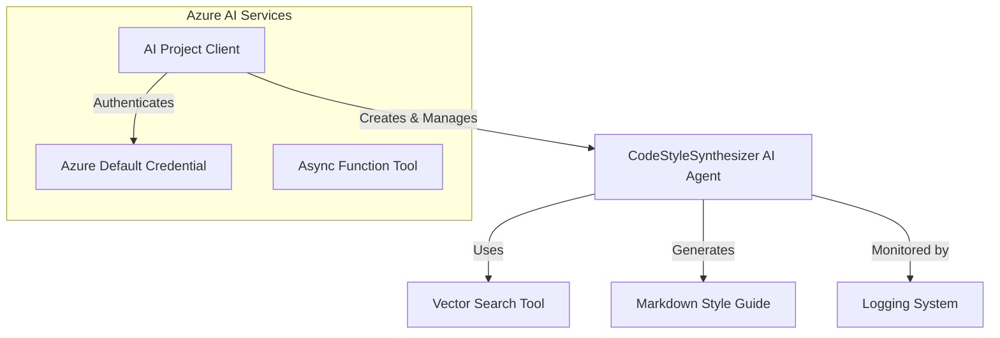

# DeepWiki Documentation

## Overview

This project leverages Azure AI Agents to automatically generate a code style guide based on existing code snippets. The primary module, `code_style.py`, uses the Azure AI Agents service to analyze coding patterns and stylistic conventions across a codebase. Using vector search techniques, the system synthesizes a comprehensive Markdown-style guide covering naming conventions, code organization, documentation standards, error handling, and logging practices. The project demonstrates the integration of AI services with practical software development tools and processes.

## Major Concepts

### AI Agents

The code uses Azure AI Agents to automate the process of generating a code style guide. The agent, named `CodeStyleSynthesizer`, is configured with specific capabilities and constraints through a system prompt. It performs a vector search to gather code snippets that illustrate various coding patterns.

### Azure AI Services

The project leverages several Azure AI services:
- **AIProjectClient**: Manages the interaction with Azure AI, including authentication and agent execution.
- **DefaultAzureCredential**: Handles authentication with Azure services.
- **AsyncFunctionTool**: Registers the vector search function, enabling the agent to interact with code snippets.

### Logging

The module includes extensive logging capabilities to monitor and debug the agent's operations. Logging allows tracking of key events such as agent creation, execution status, and tool interactions.

### Error Handling

Error handling is implemented using try-except blocks, capturing exceptions related to failed agent execution and authentication issues. Comprehensive log messages provide context and tracebacks for errors.

### Vector Search

The vector search tool is crucial for locating relevant code snippets in a database. It allows the agent to retrieve examples based on coding patterns and conventions, forming the basis of the generated style guide.

## System Architecture



## Snippet Catalog

| Snippet ID          | Language | Purpose                               |
|---------------------|----------|---------------------------------------|
| ai-agents-service-usage | Python   | Generate code style guide using Azure AI |

## Walkthrough

1. **Initialize Azure Authentication**:
   ```python
   async with DefaultAzureCredential() as credential:
       # Authentication code
   ```

2. **Create AI Project Client**:
   ```python
   async with AIProjectClient.from_connection_string(credential=credential, conn_str="...") as project_client:
       # Set up the AI Project Client
   ```

3. **Set Up Vector Search Tool**:
   ```python
   functions = AsyncFunctionTool(functions=[vector_search.vector_search])
   ```

4. **Create and Configure the AI Agent**:
   ```python
   agent = await project_client.agents.create_agent(
       name="CodeStyleSynthesizer",
       instructions=_CODE_STYLE_SYSTEM_PROMPT,
       tools=functions.definitions,
       model="your_model_name"
   )
   ```

5. **Run Agent and Retrieve Style Guide**:
   ```python
   run = await project_client.agents.create_run(thread_id=thread.id, agent_id=agent.id)
   # Handle tool calls and retrieve response
   ```

## Best Practices

- **Configure Logging**: Ensure logging focuses on relevant application logs by setting appropriate levels for third-party libraries.
- **Manage Credentials Securely**: Use environment variables for sensitive information like connection strings.

## Anti-Patterns

- **Over-Logging**: While logging is useful, excessive logging can clutter outputs. Focus on key events and status updates.
- **Multiple Vector Searches**: Follow the requirement to use the vector search tool only once to prevent redundancy and inefficiency.

## Further Reading

- [Azure AI Documentation](https://learn.microsoft.com/en-us/azure/ai-services/)
- [Python Logging Documentation](https://docs.python.org/3/library/logging.html)
- [Azure Identity Library](https://learn.microsoft.com/en-us/python/api/overview/azure/identity-readme?view=azure-python)